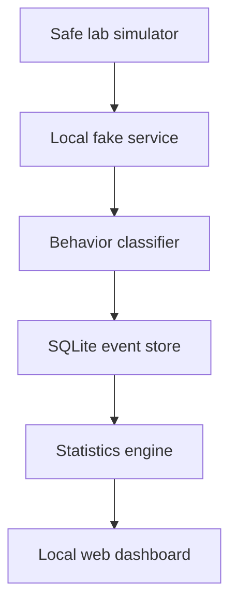

# DecoyAI Honeypot System

DecoyAI is a **localhost-only educational cyber-deception laboratory**. It runs
a controlled fake TCP service, records interactions in SQLite, classifies
suspicious behavior with explainable rules, calculates attack statistics, and
presents results on a local web dashboard.

> DecoyAI is deliberately restricted to `127.0.0.1`. It does not expose a
> service to the internet, execute received commands, collect real credentials,
> attack other systems, or automatically block addresses.

## Portfolio Features

- Controlled fake SSH-like banner service
- Sanitized interaction logging with UTC timestamps
- Explainable behavior categories and risk scores
- SQLite event storage and attack statistics
- Local responsive web dashboard and JSON statistics API
- Safe traffic simulator
- Labeled laboratory evaluation dataset and reproducible accuracy report
- Automated tests for classification, storage, and safety controls
- Ethical, legal, architecture, proposal, and threat-model documentation
- Python standard library only

## Architecture



## Quick Start

Requires Python 3.9 or newer. Open two terminals in the project folder.

Terminal 1:

```bash
python run_decoyai.py
```

Terminal 2:

```bash
python lab_simulator.py
```

Open <http://127.0.0.1:8080> to view the dashboard. Press `Ctrl+C` in the first
terminal to stop the system.

## Run Tests and Evaluation

```bash
python -m unittest discover -s tests -v
python evaluate.py
```

The evaluation uses only synthetic, labeled text. Its result measures agreement
with this small ruleset and **does not prove real-world detection quality**.

## Classification

| Category | Example indicator | Score |
| --- | --- | ---: |
| Unknown probe | No known pattern | 10 |
| Empty probe | Connects without data | 20 |
| Scanner probe | `nmap`, `masscan`, `zgrab` | 45 |
| Credential probe | `login`, `admin`, `password` | 55 |
| Injection probe | traversal or injection pattern | 75 |
| Command probe | download, shell, or command keyword | 80 |

When multiple patterns match, the highest-risk category becomes primary and all
matched reasons are preserved. Payloads are treated only as text.

## Repository Structure

```text
decoyai-honeypot/
├── decoyai/                 # classifier, storage, service, dashboard
├── evaluation/              # safe labeled dataset
├── tests/                   # automated tests
├── docs/                    # proposal, architecture, ethics, threat model
├── data/                    # generated SQLite database
├── run_decoyai.py
├── lab_simulator.py
├── evaluate.py
├── README.md
├── SECURITY.md
└── LICENSE
```

## Important Limitations

- It is a laboratory demonstration, not a production honeypot.
- Keyword rules can produce false positives and false negatives.
- All simulator traffic appears from localhost.
- Payload previews may still contain sensitive text; never use real credentials.
- The dashboard has no login because it is hard-limited to localhost.
- The fake service does not emulate a shell or full SSH protocol.

## Documentation

- [Project proposal](docs/PROJECT_PROPOSAL.md)
- [System architecture](docs/ARCHITECTURE.md)
- [Ethical and legal safeguards](docs/ETHICS_AND_LEGAL.md)
- [Threat model](docs/THREAT_MODEL.md)
- [Security policy](SECURITY.md)

## Suggested GitHub Topics

`python` · `cybersecurity` · `honeypot` · `cyber-deception` ·
`threat-detection` · `sqlite` · `security-dashboard` · `blue-team`
