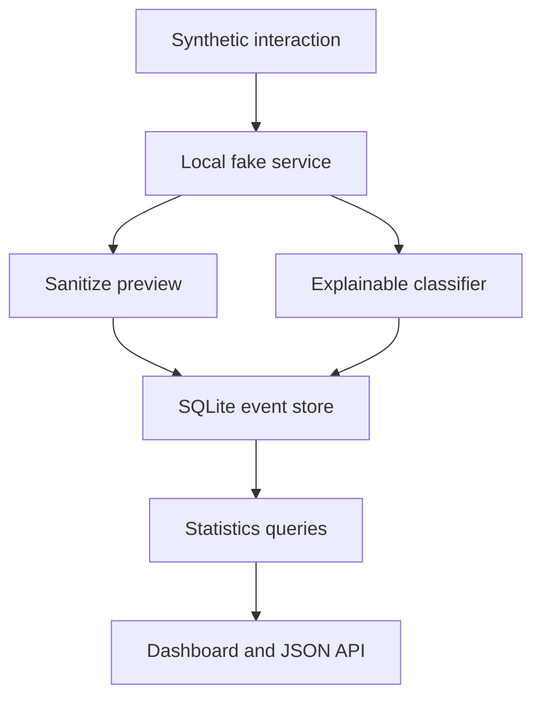
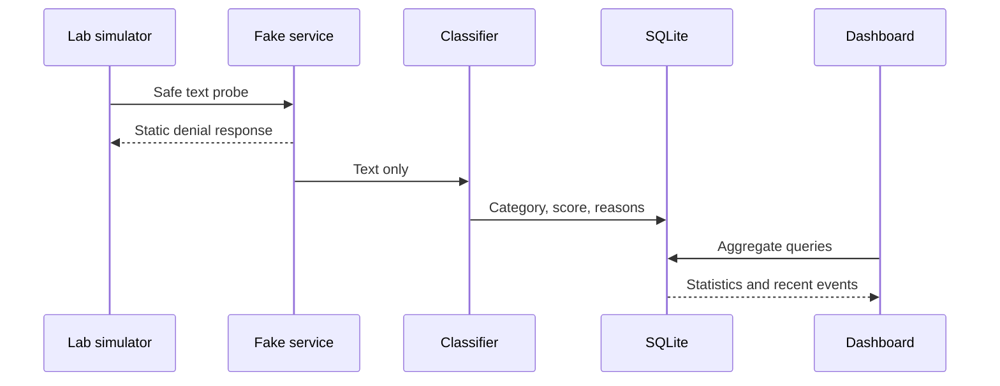

# System Architecture

| Component | Responsibility | Trust boundary |
| --- | --- | --- |
| Fake service | Sends banner and reads at most 1,024 bytes | Localhost only |
| Classifier | Matches text against explainable patterns | Never executes text |
| Store | Persists events and calculates aggregates | Local SQLite file |
| Dashboard | Escapes event text and shows statistics | Localhost only |
| Simulator | Produces synthetic demonstrations | Connects only to localhost |
| Evaluator | Compares predicted and expected categories | Offline labeled data |

## Event Flow

No component launches a process, authenticates a user, downloads content, scans
a network, or modifies another system.
